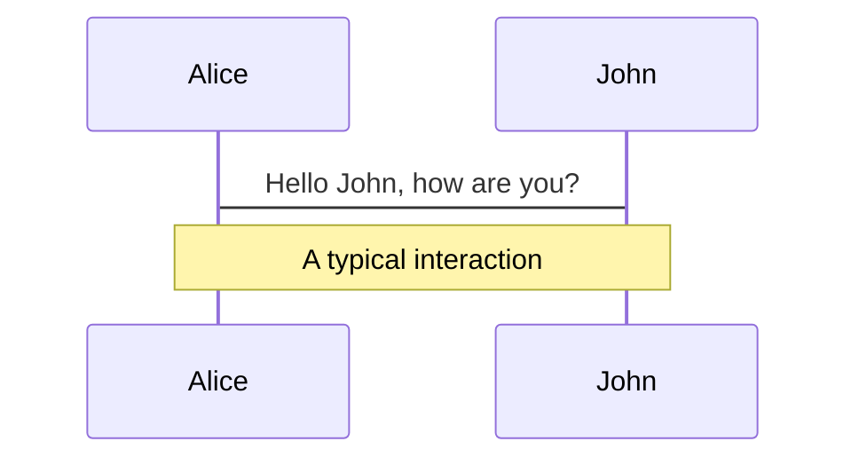
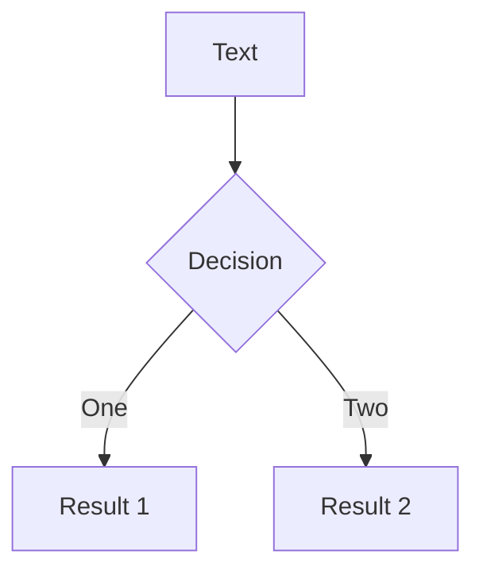

---
relates:
  - Mermaid: http://mermaid.js.org/
  - Mermaid Live Editor: https://mermaid.live/
  - Demo Slide: https://sli.dev/demo/starter/12
  - features/plantuml
tags: [图表]
description: |
  在 Mermaid 的驱动下，通过文本描述创建图表。
---

# Mermaid.js 图表

你可以基于 [Mermaid](https://mermaid-js.github.io/mermaid)，使用文本描述创建图表/图形。

被标记为 `mermaid` 的代码块将被转换为图表，例如：

````md

````

你还可以传递选项对象给 Mermaid，以指定缩放和主题。此处的语法是 JavaScript 对象字面量，你需要为字符串添加引号(`'`)，并在键之间使用逗号(`,`)。

````md

````

参阅 [Mermaid 官网](http://mermaid.js.org/) 以获取更多细节。
