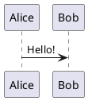

---
relates:
  - Plant UML: https://plantuml.com/
  - Plant UML Live Editor: https://plantuml.com/plantuml
  - Example side: https://sli.dev/demo/starter/12
  - features/mermaid
tags: [图表]
description: |
  在 PlantUML 驱动下，通过文本描述创建图表。
---

# PlantUML 图表

You can create PlantUML diagrams easily in your slides, for example:

````md

````

The source code will be sent to https://www.plantuml.com/plantuml to render the diagram by default. You can also set up your own server by setting the `plantUmlServer` in the [Slidev configuration](../custom/index#headmatter).

Visit the [PlantUML Website](https://plantuml.com/) for more information.
