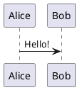

---
relates:
  - Plant UML: https://plantuml.com/
  - Plant UML 在线编辑器: https://plantuml.com/plantuml
  - Demo: https://sli.dev/demo/starter/12
  - features/mermaid
tags: [图表]
description: |
  在 PlantUML 驱动下，通过文本描述创建图表。
---

# PlantUML 图表

你可以在幻灯片中轻松地创建 PlantUML 图表，例如：

````md

````

默认情况下，这部分源代码将被发送到 [https://www.plantuml.com/plantuml](https://www.plantuml.com/plantuml) 进行渲染。你也可以通过在 [headmatter](../custom/index#headmatter) 中设置 `plantUmlServer` 来设置自己的服务器。

参阅 [PlantUML官网](https://plantuml.com/) 了解更多信息。
