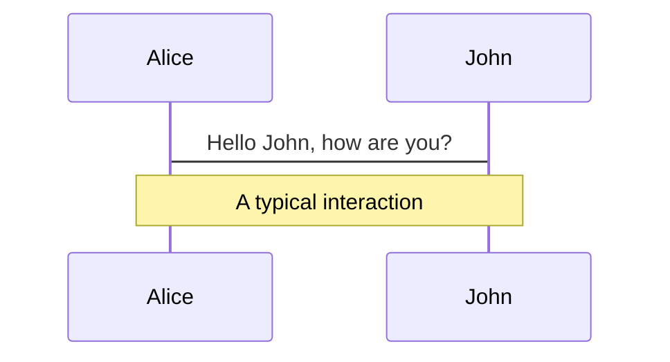
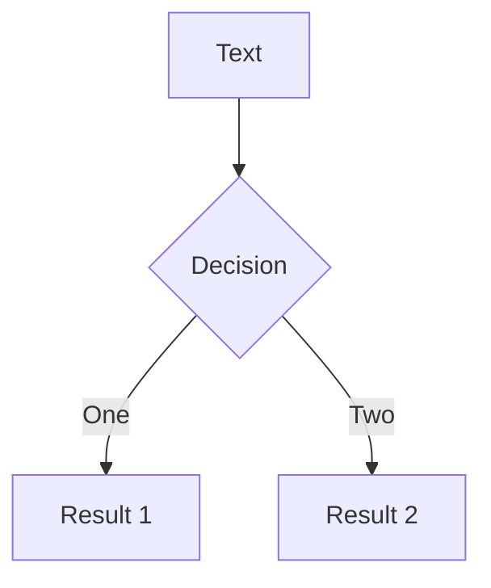

# Markdown 语法 {#markdown-syntax}

幻灯片通过 **一个 markdown 文件** 编写而成 (默认会使用 `./slides.md`)。

你可以像平时编写 markdown 一样使用 [Markdown 的相关特性](https://github.com/adam-p/markdown-here/wiki/Markdown-Cheatsheet)，同时还支持内联的 HTML 和 Vue 组件。也支持使用 [UnoCSS](/custom/config-unocss) 来编写样式。使用 `---` 添加分隔符来分隔你的幻灯片。

````md
# Slidev

Hello, World!

---

# Page 2

Directly use code blocks for highlighting

```ts
console.log('Hello, World!')
```

---

# Page 3

You can directly use Windi CSS and Vue components to style and enrich your slides.

<div class="p-3">
  <Tweet id="20" />
</div>
````

## 扉页及布局 {#front-matter-layouts}

你可以通过将分隔符转换为 [扉页块 (front matter)](https://jekyllrb.com/docs/front-matter/)，为每张幻灯片指定布局 (layout) 和其他元数据。每个扉页信息都以分隔符 `---` 开始，以另一个分隔符 `---` 结束。两个分隔符之间的文本是 [YAML](https://www.cloudbees.com/blog/yaml-tutorial-everything-you-need-get-started/) 格式的数据对象。具体示例如下：


<!-- eslint-skip -->

```md
---
layout: cover
---

# Slidev

This is the cover page.

---
layout: center
background: './images/background-1.png'
class: 'text-white'
---

# Page 2

This is a page with the layout `center` and a background image.

---

# Page 3

This is a default page without any additional metadata.
```

欲了解更多，请参阅 [自定义](/custom/) 章节。

### Prettier 支持

> Available since v0.44

自定义语法可能无法与某些代码格式化工具（如 Prettier）兼容。你可以安装 [Prettier Plugin](/guide/editors#prettier-plugin) 插件，或者直接使用 `yaml` 语法来定义扉页信息:

````md
---
layout: cover
---

# Slidev

This is the cover page.

---

```yaml
# The first yaml block will be treated as the frontmatter of that slide
layout: center
background: './images/background-1.png'
class: 'text-white'
```

# Page 2

This is a page with the layout `center` and a background image.
````

## 代码块 {#code-blocks}

建立 Slidev 一个非常重要的原因就是为了让代码在幻灯片中拥有正确的高亮。如你所见，你可以使用 Markdown 风格的代码块，以使得你的代码高亮。

````md
```ts
console.log('Hello, World!')
```
````

我们支持 [Prism](https://prismjs.com) 和 [Shiki](https://github.com/shikijs/shiki) 作为语法高亮器。请参阅 [语法高亮器](/custom/highlighters) 获取更多细节。

### 特定行高亮 {#line-highlighting}

如需针对特定行进行高亮展示，只需在 `{}` 内添加对应的行号。行号从 1 开始计算。

````md
```ts {2,3}
function add(
  a: Ref<number> | number,
  b: Ref<number> | number
) {
  return computed(() => unref(a) + unref(b))
}
```
````

你可以通过在[配置](/guide/syntax#configurations)设置 `lineNumbers: true` 为所有幻灯片启用行号，也可以通过设置 `lines: true` 为每个代码块单独启用行号。你还可以为每个代码块设置起始行，并相应地突出显示行，默认值为 1

````md
```ts {6,7}{lines:true,startLine:5}
function add(
  a: Ref<number> | number,
  b: Ref<number> | number
) {
  return computed(() => unref(a) + unref(b))
}
```
````

如果要在多个步骤中改变高亮，你可以用 `|` 分隔它们：

````md
```ts {2-3|5|all}
function add(
  a: Ref<number> | number,
  b: Ref<number> | number
) {
  return computed(() => unref(a) + unref(b))
}
```
````

这段代码会先对 `a: Ref<number> | number` 和 `b: Ref<number> | number` 进行高亮展示，当你点击幻灯片后，会高亮展示 `return computed(() => unref(a) + unref(b))`，最后，会对整个块进行高亮展示。

你可以将行号设置为 `hide` 以隐藏代码块，或将行号设置为 `none` 以不高亮展示任何行：
````md
```ts {hide|none}
function add(
  a: Ref<number> | number,
  b: Ref<number> | number
) {
  return computed(() => unref(a) + unref(b))
}
```
````

::: tip
你可以在 [动画指南](./animations#positioning) 中了解更多。
:::

如果代码在一张幻灯片展示不下，你可以传递一个额外的 maxHeight 选项，该选项将为代码段设置固定高度并启用滚动：

````md
```ts {2|3|7|12}{maxHeight:'100px'}
function add(
  a: Ref<number> | number,
  b: Ref<number> | number
) {
  return computed(() => unref(a) + unref(b))
}
/// ...as many lines as you want
const c = add(1, 2)
```
````

### TwoSlash Integration

> Available since v0.46

This feature is only available when you [set `highlighter` to `shiki`](/custom/highlighters)

[TwoSlash](https://twoslash.netlify.app/) is a powerful tool for rendering TypeScript code blocks with type information on hover or inlined. It's quite useful for preparing slides for JavaScript/TypeScript-related topics.

To use it, you can add `twoslash` to the code block's language identifier:

````md
```ts twoslash
import { ref } from 'vue'

const count = ref(0)
//            ^?
```
````

It will be rendered as:

```ts twoslash
import { ref } from 'vue'

const count = ref(0)
//            ^?
```

<!-- For the popup to not to overlap the content below -->
<div class="py-20" />

### Shiki Magic Move

> Available since v0.48

[Shiki Magic Move](https://github.com/shikijs/shiki-magic-move) enables you to have granular transition between code changes, similar to Keynote's Magic Move. You can check [the playground](https://shiki-magic-move.netlify.app/) to see how it works.

In Slidev, we bind it to the [clicks system](/guide/animations#click-animations). The syntax is wrap multiple code blocks representing each steps with <code>````md magic-move</code> (mind it's **4** backticks), this will be transformed into one code block, that morphing to each steps as you click.

`````md
````md magic-move
```js
console.log(`Step ${1}`)
```
```js
console.log(`Step ${1 + 1}`)
```
```ts
console.log(`Step ${3}` as string)
```
````
`````

It's also possible mix Magic Move with [line highlighting](#line-highlighting), for example:

`````md
````md magic-move {at:4} // [!code hl]
```js {*|1|2-5} // [!code hl]
let count = 1
function add() {
  count++
}
```

Non-code blocks in between as ignored, you can put some comments.

```js
let count = 1
const add = () => count += 1
```
````
`````

<!-- TODO: add an inline demo -->

### Monaco 编辑器 {#monaco-editor}

当你需要在演示文稿中做修改时，只需在语言 id 后添加 `{monaco}` —— 即可将该代码块变为一个功能齐全的 Monaco 编辑器。

````md
```ts {monaco}
console.log('HelloWorld')
```
````

欲了解更多，请参阅 [配置 Monaco](/custom/config-monaco)。

#### Monaco Diff

Monaco can also generate a diff between two code blocks. Use `{monaco-diff}` to turn the block into a [diff Monaco editor](https://microsoft.github.io/monaco-editor/playground.html?source=v0.36.1#example-creating-the-diffeditor-multi-line-example) and use `~~~` to separate both original and modified version of the code!

````md
```ts {monaco-diff}
console.log('Original text')
~~~
console.log('Modified text')
```
````

#### Monaco Runner

> Available since v0.48

Slidev also provides the Monaco Runner Editor, which allows you to run the code directly in the editor and see the result. Use `{monaco-run}` to turn the block into a Monaco Runner Editor.

````md
```ts {monaco-run}
function distance(x: number, y: number) {
  return Math.sqrt(x ** 2 + y ** 2)
}
console.log(distance(3, 4))
```
````

It will provide the editor with a "Run" button, and shows the result right below the code block. You many also modify the code and the result will be re-evaluated on the fly.

By default it will automatically runs the code when the slide is loaded, if you want to always explicitly trigger the run, you can set `{autorun:false}`.

````md
```ts {monaco-run} {autorun:false}
console.log('HelloWorld')
```
````

Currently Slidev supports running JavaScript and TypeScript code out-of-box. Refer to [Custom Code Runners](/custom/config-code-runners) for custom languages support.

## 内联样式 {#embedded-styles}

你可以在 Markdown 中直接使用 `<style>` 标签来覆盖**当前幻灯片**的样式。

```md
# This is Red

<style>
h1 {
  color: red
}
</style>

---

# Next slide is not affected
```

Markdown 中的 `<style>` 标签均为 [scoped](https://vue-loader.vuejs.org/guide/scoped-css.html)。子选择器 (如 `.a > .b`) 在这里不起作用。如果想覆盖全局样式，请查阅 [项目结构](/custom/directory-structure#style)。

在 [UnoCSS](/custom/config-unocss) 的支持下，你可以直接使用嵌套的 CSS 和 [指令](https://unocss.dev/transformers/directives)。(例如，`--uno:` 或 `@apply`)

```md
# Slidev

> Hello `world`

<style>
blockquote {
  code {
    --uno: text-teal-500 dark:text-teal-400;
  }
}
</style>
```

## 静态资源 {#static-assets}

和编写 Markdown 的方式一样，你可以使用本地或远程的 URL 的图片。

如果是远程资源，内置的 [`vite-plugin-remote-assets`](https://github.com/antfu/vite-plugin-remote-assets) 将在第一次运行时把它们缓存到磁盘中，即便是大图也能实现立即加载。

```md

```

如果是本地资源，请将资源放置到 [`public` 文件夹](/custom/directory-structure.html#public) 中并使用 **/** 开头的 URL 来引用它们。

```md

```

如果你想使用自定义的尺寸或样式，可以使用 `` 标签

```html

```

## 备注 {#notes}

你也可以为每张幻灯片编写备注。它们将展示在 [演讲者模式](/guide/presenter-mode) 中，供你在演示时参考。

在 Markdown 中，每张幻灯片中的最后一个注释块将被视为备注。

```md
---
layout: cover
---

# 第 1 页

This is the cover page.

<!-- 这是一条备注 -->

---

# 第 2 页

<!-- 这不是一条备注，因为它在幻灯片内容前 -->

The second page

<!--
这是另一条备注
-->
```

Basic Markdown and HTML are also supported in notes on Presenter renderering.

### Click Markers

> Available since v0.48

For some slides you might have longer notes that might be hard to find where you are looking at, we introduced the click markers that allows highlighting and auto-scrolling to the section of notes of your corresponding content. Put `[click]` markers in your notes for the timming you need to go to another [click](/guide/animations#click-animations), Slidev divide the content between the click markers and highlight them in presenter notes, synchronized with your slide progress.

<!-- TODO: add a video -->

## 图标 {#icons}

Slidev 允许你在 Markdown 中在安装对应包后访问几乎所有的开源的图标集。这得益于 [`unplugin-icons`](https://github.com/antfu/unplugin-icons) 和 [Iconify](https://iconify.design/)。

图标 ID 遵循 [Iconify](https://iconify.design/) 的命名规则 `{collection-name}-{icon-name}`。例如：

- 使用 [Material Design Icons](https://github.com/Templarian/MaterialDesign)，其规则为 `<mdi-account-circle />` - <mdi-account-circle />
- 使用 [Carbon](https://github.com/carbon-design-system/carbon/tree/main/packages/icons)，其规则为 `<carbon-badge />` - <carbon-badge />
- 使用 [Unicons Monochrome](https://github.com/Iconscout/unicons)，其规则为 `<uim-rocket />` - <uim-rocket />
- 使用 [Twemoji](https://github.com/twitter/twemoji)，其规则为 `<twemoji-cat-with-tears-of-joy />` - <twemoji-cat-with-tears-of-joy />
- 使用 [SVG Logos](https://github.com/gilbarbara/logos)，其规则为 `<logos-vue />` - <logos-vue />
- 还有更多...

你可以通过 [Icônes](https://icones.js.org/) 来浏览访问所有可用的图标。

### 调整图标样式 {#styling-icons}

你可以像其他 HTML 元素一样对图标的样式进行修改。例如：

```html
<uim-rocket />
<uim-rocket class="text-3xl text-red-400 mx-2" />
<uim-rocket class="text-3xl text-orange-400 animate-ping" />
```

<uim-rocket />
<uim-rocket class="text-3xl text-red-400 mx-2" />
<uim-rocket class="text-3xl text-orange-400 animate-ping ml-2" />

## 插槽 {#slots}

> 自 v0.18 开始可用

一些布局可以使用 [Vue 的具名插槽](https://v3.vuejs.org/guide/component-slots.html)。

例如，在 [`two-cols` 布局](https://github.com/slidevjs/slidev/blob/main/packages/client/layouts/two-cols.vue) 中，你可以采用左（`default` 插槽）右（`right` 插槽）两列的布局方式。

```md
---
layout: two-cols
---

<template v-slot:default>

# Left

This shows on the left

</template>
<template v-slot:right>

# Right

This shows on the right

</template>
```

<div class="grid grid-cols-2 rounded border border-gray-400 border-opacity-50 px-10 pb-4">
<div>
<h3>Left</h3>
<p>This shows on the left</p>
</div>
<div>
<h3>Right</h3>
<p>This shows on the right</p>
</div>
</div>

我们还为具名插槽提供了一个语法糖 `::name::`。下述示例与上述示例的工作原理完全相同。

```md
---
layout: two-cols
---

# Left

This shows on the left

::right::

# Right

This shows on the right
```

你也可以明确的指定默认插槽，并按自定义顺序展示。

```md
---
layout: two-cols
---

::right::

# Right

This shows on the right

::default::

# Left

This shows on the left
```

## Import Code Snippets

> Available since v0.47.0

You can import code snippets from existing files via the following syntax:

```md
<<< @/snippets/snippet.js
```

::: tip
The value of `@` corresponds to your package's root directory. It's recommended to put snippets in `@/snippets`, for compatibility with the Monaco editor. Alternatively, you can also import from relative paths.
:::

You can also use a [VS Code region](https://code.visualstudio.com/docs/editor/codebasics#_folding) to only include the corresponding part of the code file:

```md
<<< @/snippets/snippet.js#region-name
```

To explicitly specify the language of the imported code, you can add a language identifier after:

```md
<<< @/snippets/snippet.js ts
```

Any code block features like [line highlighting](#line-highlighting) and [Monaco editor](#monaco-editor) are also supported:

```md
<<< @/snippets/snippet.js {2,3|5}{lines:true}
<<< @/snippets/snippet.js ts {monaco}{height:200px}
```

## 配置 {#configurations}

依赖的所有配置都可以在 Markdown 文件中定义，比如：

```md
---
theme: seriph
layout: cover
background: 'https://source.unsplash.com/1600x900/?nature,water'
---

# Slidev

This is the cover page.
```

欲了解更多，请参阅 [扉页配置](/custom/#frontmatter-configures) 章节。

## LaTeX {#latex}

Slidev 开箱即有对 LaTeX 的支持，得益于 [KaTeX](https://katex.org/)。

<TheTweet id="1392246507793915904" />

### 内联 {#inline}

在你的 LaTeX 语法左右各加一个 `$`，用于内联渲染。

```md
$\sqrt{3x-1}+(1+x)^2$
```

### 块 {#block}

当使用两个 (`$$`) 时，会进行块级渲染。这种模式会使用更大的符号，并将结果居中。

```latex
$$
\begin{array}{c}

\nabla \times \vec{\mathbf{B}} -\, \frac1c\, \frac{\partial\vec{\mathbf{E}}}{\partial t} &
= \frac{4\pi}{c}\vec{\mathbf{j}}    \nabla \cdot \vec{\mathbf{E}} & = 4 \pi \rho \\

\nabla \times \vec{\mathbf{E}}\, +\, \frac1c\, \frac{\partial\vec{\mathbf{B}}}{\partial t} & = \vec{\mathbf{0}} \\

\nabla \cdot \vec{\mathbf{B}} & = 0

\end{array}
$$
```

了解更多：[Demo](https://sli.dev/demo/starter/8) | [KaTeX](https://katex.org/) | [`markdown-it-katex`](https://github.com/waylonflinn/markdown-it-katex)

### LaTex line highlighting

> Available since v0.43.1

To highlight specific lines, simply add line numbers within bracket `{}`. Line numbers start counting from 1 by default.

```latex
$$ {1|3|all}
\begin{array}{c}
\nabla \times \vec{\mathbf{B}} -\, \frac1c\, \frac{\partial\vec{\mathbf{E}}}{\partial t} &
= \frac{4\pi}{c}\vec{\mathbf{j}}    \nabla \cdot \vec{\mathbf{E}} & = 4 \pi \rho \\
\nabla \times \vec{\mathbf{E}}\, +\, \frac1c\, \frac{\partial\vec{\mathbf{B}}}{\partial t} & = \vec{\mathbf{0}} \\
\nabla \cdot \vec{\mathbf{B}} & = 0
\end{array}
$$
```

The `at` and `finally` options of [code blocks](#line-highlighting) are also available for LaTeX blocks.

## 图表 {#diagrams}

你也可以在 Markdown 的文本描述中创建图形或图表，得益于 [Mermaid](https://mermaid-js.github.io/mermaid)。

被标记为 `mermaid` 的代码块将被转换为图形，例如：

````md

````

你可以向它传递一个配置项来指定缩放和主题。该对象的语法是 JavaScript 的对象字面量，你需要对字符串添加引号 (`'`)，并在键与键之间使用(`,`)。

````md

````

了解更多：[Demo](https://sli.dev/demo/starter/9) | [Mermaid](https://mermaid-js.github.io/mermaid)

## 多个入口点 {#multiple-entries}

> 自 v0.15 开始可用

这意味着你可以将 `slides.md` 分割成多个文件，并可以按照你的需求组织它们。

`slides.md` :

<!-- eslint-skip -->

```md
# Page 1

This is a normal page

---
src: ./subpage2.md
---

<!-- this page will be loaded from './subpage2.md' -->
Inline content will be ignored
```

`subpage2.md` :

```md
# Page 2

This page is from another file
```

### 合并 Frontmatter {#frontmatter-merging}

你可以为主入口点和外部 markdown 页面提供 frontmatter。如果其中有相同的 key，**主入口点的 key 拥有更高的优先级**。例如：

`slides.md` :

```md
---
src: ./cover.md
background: https://sli.dev/bar.png
class: text-center
---
```

`cover.md` :

```md
---
layout: cover
background: https://sli.dev/foo.png
---

# Cover

Cover Page
```

其效果最终与下述页面相同：

```md
---
layout: cover
background: https://sli.dev/bar.png
class: text-center
---

# Cover

Cover Page
```

### 页面复用 {#page-reusing}

有了多入口点的加持，对页面进行重用变得很容易。例如：

```yaml
---
src: ./cover.md
---

---
src: ./intro.md
---

---
src: ./content.md
---

---
# reuse
src: ./content.md
---
```

## MDC Syntax

> Available since v0.43.0

Slidev supports optional [MDC (Markdown Components) Syntax](https://content.nuxtjs.org/guide/writing/mdc) powered by [`markdown-it-mdc`](https://github.com/antfu/markdown-it-mdc).

You can enable it by adding `mdc: true` to the frontmatter of your markdown file.

```mdc
---
mdc: true
---

This is a [red text]{style="color:red"} :inline-component{prop="value"}

{width=500px lazy}

::block-component{prop="value"}
The **default** slot
::
```

Learn more about [the syntax](https://content.nuxt.com/guide/writing/mdc).
